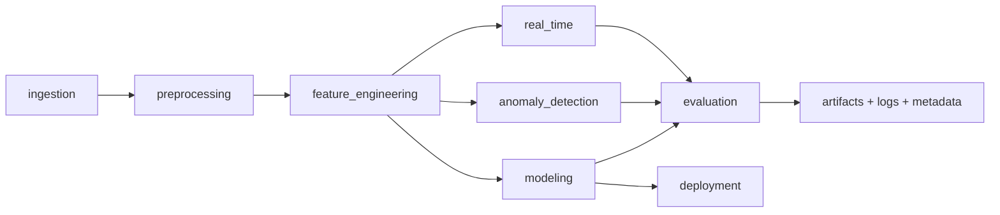

# Research-Grade, Hardware-Aware Healthcare AI System

This repository is a modular, reproducible healthcare AI experimentation system with stronger research rigor, streaming realism, hardware-awareness, and deployment checks.

## Architecture



## Modules

Located in `Data Analysis for Hospitals/task/`:

- `ingestion/`: dataset loading + dataset manifest hashing/versioning.
- `preprocessing/`: cleaning, missing-value handling, canonical categories.
- `feature_engineering/`: age and risk-oriented features.
- `modeling/`: sklearn-based predictive models + repeated stratified CV + calibration reports.
- `anomaly_detection/`: z-score detector, Isolation Forest detector, detector-comparison artifacts.
- `real_time/`: batch/stream comparison and async queue simulation (jitter, buffer, backpressure).
- `evaluation/`: benchmarking, confidence intervals, hardware-constrained early-warning, and time-aware alert metrics.
- `deployment/`: ONNX export, ONNX parity validation, and CPU inference-latency measurement.
- `utils/`: reproducibility seeds, hardware simulation, telemetry, runtime metadata, logging, energy estimates.
- `config.py`: centralized experiment configuration.
- `cli.py`: command-line interface for reproducible full-pipeline execution.

## Reproducible workflow

```bash
cd "Data Analysis for Hospitals/task"
python cli.py manifest
python cli.py run
python cli.py early-warning-experiment
```

## What is newly enforced for research rigor

### 1) Robust predictive modeling
- Repeated stratified k-fold with multiple seeds.
- Fold-level artifacts:
  - `artifacts/predictive_cv_folds.csv`
  - `artifacts/predictive_cv_report.json`
- Calibration artifacts:
  - `artifacts/predictive_reliability_curve.csv`
- Metrics include accuracy, F1, AUC, and Brier score.

### 2) Time-aware early-warning metrics
- Temporal split utility via rolling-origin windows.
- Detection delay distribution and early-warning gain.
- False alarms per hour.
- Precision-recall at configurable alert budgets.

### 3) Realistic anomaly detection comparison
- Baseline z-score vs Isolation Forest.
- Robustness/detection quality comparison artifact:
  - `artifacts/anomaly_detector_comparison.csv`

### 4) Streaming and systems realism
- Async simulation with variable arrivals, jitter, queue limits, and drop accounting.
- Throughput/latency + queue/buffer stress indicators.

### 5) Hardware and energy realism
- Optional CPU/memory telemetry via `psutil`.
- Optional measured energy via Intel RAPL when available.
- Estimated-vs-measured energy comparison in pipeline output.

### 6) Deployment readiness
- sklearn-compatible predictive model for robust ONNX export.
- ONNX parity check against Python inference (when onnxruntime is available).

### 7) Reproducibility hardening
- Global seed control.
- Dataset fingerprinting (`dataset_manifest.json`).
- Runtime metadata capture (`runtime_metadata.json`) including Python/platform/package versions.
- Environment lockfile: `requirements-lock.txt`.

### 8) CI and reliability
GitHub Actions workflow (`.github/workflows/ci.yml`) runs:
- compile checks,
- legacy tests,
- full pipeline and early-warning commands,
- reproducibility tests,
- deterministic artifact existence checks.

## Artifacts and benchmarking

Artifacts under `Data Analysis for Hospitals/task/artifacts/` include:
- `dataset_manifest.json`
- `experiment_log.json`
- `runtime_metadata.json`
- `risk_model.onnx` (if conversion succeeds)
- `predictive_cv_folds.csv`
- `predictive_cv_report.json`
- `predictive_reliability_curve.csv`
- `anomaly_detector_comparison.csv`
- `early_warning_hardware_experiment.csv`
- `latency_vs_accuracy.png`
- `resource_vs_detection_quality.png`

## Legacy functionality preserved

The original plotting workflow remains available:

```bash
cd "Data Analysis for Hospitals/task"
python analysis.py
```

It still emits three plots and three answer lines.

## Domain alignment narrative

The pipeline now includes explicit outputs that map to:
- **ICU monitoring** (alert-latency vs sensitivity trade-offs),
- **wearable edge AI** (memory/compute constrained sweeps),
- **medical telemetry systems** (bursty async ingestion with queue/drop behavior).
