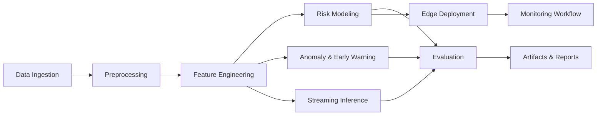

# Hardware-Aware Early Warning and Predictive Healthcare AI

This repository presents a **healthcare edge AI and early-warning systems project** focused on reliable, real-time risk detection in resource-constrained clinical environments.

It combines predictive modeling, streaming inference, and deployment-oriented evaluation to support **clinical early warning** while respecting hardware and energy limits.

## Project focus

- **Real-time monitoring:** continuous patient-data streaming and low-latency inference.
- **Resource-constrained deployment:** CPU-first execution, memory-aware batching, and lightweight model export.
- **Energy-efficient inference:** precision-aware energy estimation for edge deployment.
- **Clinical early warning:** anomaly-triggered alerts with latency and false-positive tracking.

## System architecture



Core modules are in `Data Analysis for Hospitals/task/`:

- `ingestion/`: dataset loading and manifest versioning.
- `preprocessing/`: data normalization and consistency cleanup.
- `feature_engineering/`: risk-oriented feature creation.
- `modeling/`: predictive and risk-stratification modeling.
- `anomaly_detection/`: early-warning and latency evaluation.
- `real_time/`: streaming simulation and online inference paths.
- `deployment/`: ONNX export, CPU inference, and monitoring workflow generation.
- `evaluation/`: benchmark summaries, trade-offs, and experiment analysis.
- `utils/`: reproducibility, hardware profiling, logging, and energy models.

## Edge monitoring design

The edge-monitoring path is designed to fit low-resource clinical nodes:

1. Patient records are ingested and normalized.
2. Risk and anomaly scores are computed per stream chunk.
3. Alert candidates are generated from anomaly thresholds.
4. Alert and model-health counters are aggregated into a deployment monitoring workflow.
5. Operators review drift/latency/alert-burden indicators for threshold tuning.

## Deployment pipeline

```bash
cd "Data Analysis for Hospitals/task"
python cli.py manifest
python cli.py run
python cli.py early-warning-experiment
```

This pipeline produces artifacts such as dataset manifests, experiment logs, hardware-constrained early-warning outputs, and deployment workflow summaries in `Data Analysis for Hospitals/task/artifacts/`.

## Professional research additions

### Risk modeling

The project includes risk-stratification outputs for clinically interpretable bands (`low`, `medium`, `high`) and triage-oriented prevalence reporting.

### Streaming inference

A streaming inference utility converts chunked model probabilities into online risk labels and confidence traces for real-time deployment studies.

### Deployment + monitoring workflow

A deployment monitoring summary tracks alert volume, alert rate, estimated drift, and timing of first-alert events to support operational handoff.

## Evaluation methodology

Evaluation combines:

- predictive metrics (accuracy/F1/AUC),
- early-warning latency,
- false-positive rate,
- hardware-adjusted detection quality,
- latency-vs-accuracy trade-off,
- repeated benchmark aggregation (mean/std/CI).

This multi-axis methodology is intended to quantify both model performance and real-world deployability.

## Reliability and alert burden

The project explicitly reports alert burden to address clinical usability risk:

- excessive alerting can degrade trust and induce alert fatigue,
- low latency with high false positives is treated as suboptimal,
- workflow metrics support threshold tuning and drift response.

Reliability is assessed through repeated runs, confidence intervals, and deployment telemetry rather than single-run headline accuracy.
