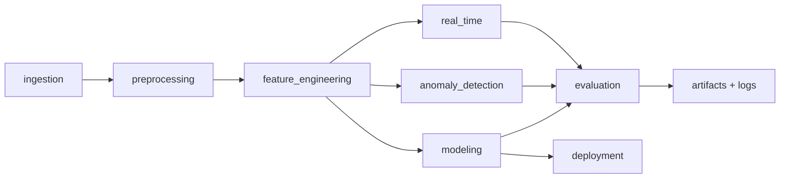

# Research-Grade, Hardware-Aware Healthcare AI System

This repository has been upgraded from a single-script EDA task into a modular, reproducible healthcare AI experimentation system targeting research and AI+hardware graduate portfolios.

## Architecture



## Modules

Located in `Data Analysis for Hospitals/task/`:

- `ingestion/`: dataset loading + dataset manifest hashing/versioning.
- `preprocessing/`: cleaning, missing-value handling, canonical categories.
- `feature_engineering/`: age and risk-oriented features.
- `modeling/`: risk prediction + patient outcome classification.
- `anomaly_detection/`: outlier detection, anomaly scoring, early-warning simulation.
- `real_time/`: streaming simulation, incremental processing, latency/throughput measurements.
- `evaluation/`: repeated benchmarking, confidence intervals, latency-vs-accuracy tradeoff, and hardware-constrained early-warning experiments.
- `deployment/`: ONNX export and CPU inference-latency measurement.
- `utils/`: reproducibility seeds, hardware constraint simulation, experiment logging, energy estimates.
- `config.py`: centralized experiment configuration.
- `cli.py`: command-line interface for running the full pipeline.

## Reproducible workflow

```bash
cd "Data Analysis for Hospitals/task"
python cli.py manifest
python cli.py run
```

## Early-warning under hardware constraints

Run targeted experiments that sweep memory limits, compute budgets, and streaming speeds:

```bash
cd "Data Analysis for Hospitals/task"
python cli.py early-warning-experiment
```

Measured metrics:
- anomaly detection latency
- prediction accuracy
- false positives / false-positive rate
- detection-quality proxy (`accuracy - 0.5 * FPR`)

Generated artifacts:
- `artifacts/early_warning_hardware_experiment.csv`
- `artifacts/latency_vs_accuracy.png`
- `artifacts/resource_vs_detection_quality.png`

## Artifacts and benchmarking

Artifacts are stored under `Data Analysis for Hospitals/task/artifacts/`:

- `dataset_manifest.json` (dataset versioning)
- `experiment_log.json` (structured run logging)
- `risk_model.onnx` (if ONNX dependencies are available)
- hardware experiment CSV + plots listed above

Benchmark outputs include mean/std/CI for:
- predictive risk accuracy runs
- hardware-constrained early-warning latency/accuracy/FPR/quality

## Legacy functionality preserved

The original plotting workflow remains available:

```bash
cd "Data Analysis for Hospitals/task"
python analysis.py
```

It still emits three plots and three answer lines while now relying on reusable modular components.

## CI and validation suggestions

Use these commands in CI:

```bash
python -m compileall "Data Analysis for Hospitals/task"
python "Data Analysis for Hospitals/task/tests.py"
python "Data Analysis for Hospitals/task/cli.py" run
python "Data Analysis for Hospitals/task/cli.py" early-warning-experiment
```

This validates code integrity, legacy behavior, full pipeline execution, and hardware-constrained early-warning artifact generation.
